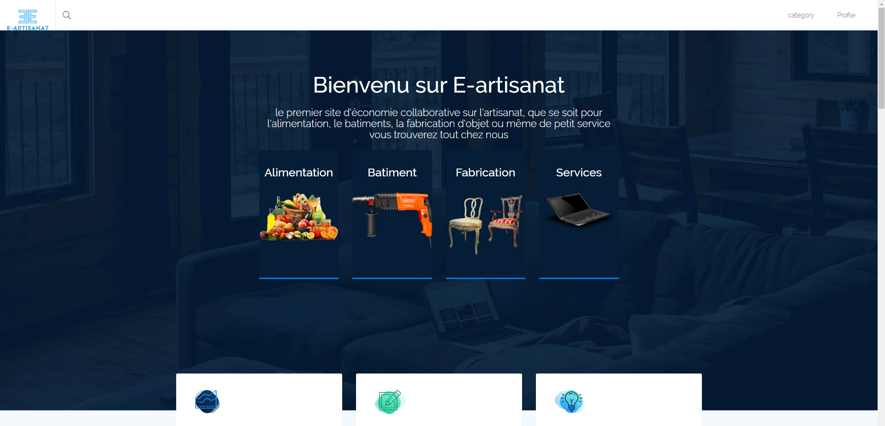
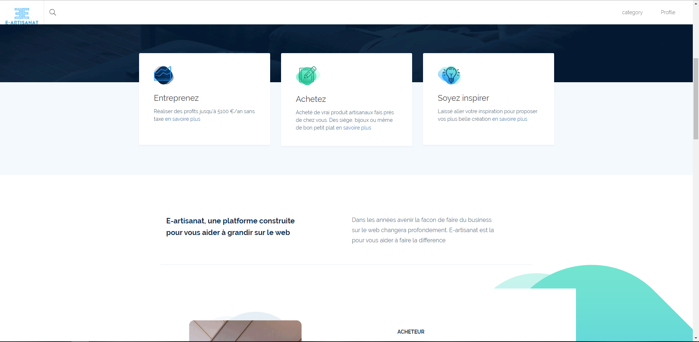
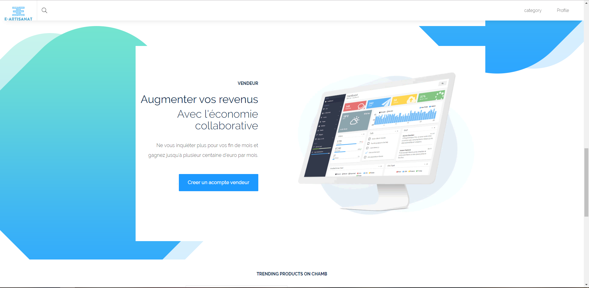
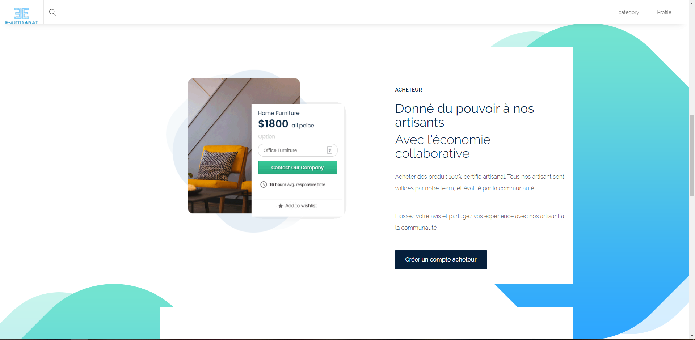

# npProject

Réalisation d'un site d'économie collaborative sur le thèmes de l'Artisanat dans le cadre de ma formation.  
## Contrainte techniques
### Technos
**Back :** PHP POO

### Element devant être présent dans le projet
- Un système de sessions : inscription, connexion / déconnexion / mot de passe perdu / différents privilèges
- Interactions utilisateurs cohérentes avec le thème de site choisi (ex: commentaires, forum, chat, inscription et vente de tickets pour l'événement avec confirmation par mail, newsletter, cartes interactives, e-shop, chatbot.....)
- L'utilisation d'**au moins** une API

**délai :** 4 semaines (du 25/11 au 18/12)

**A quoi ça ressemble ?** 

## Charte Graphique:

Font : Raleway;
color : #ffff, #474747;
background color: #09294c
navbar: fixed top 
footer: liens + reseaux sociaux

## Construit avec

* PHP Poo
* utilisation du template Chamb trouvé sur free-css (https://www.free-css.com/free-css-templates/page242/chamb)
* jquery
* Javascript vanilla
* Bootstrap 3 

## Autheurs

* **Mikhaïl Hanon** - *Travail initial* - [MikeHanon](https://github.com/MikeHanon)

    * **Lien LinkedIn** : [Mikhaïl Hanon](https://www.linkedin.com/in/mikhailhanon/)
    

